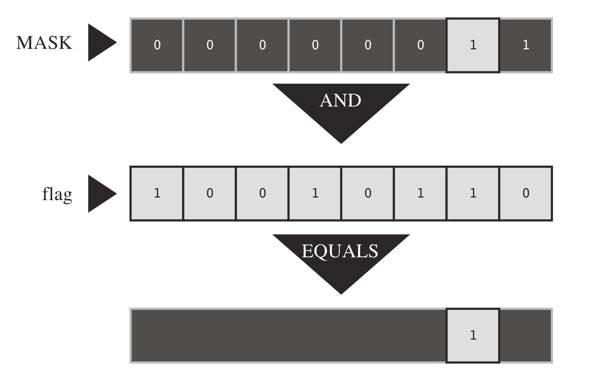

[toc]

## Binary Numbers, Bits, and Bytes

### Binary Integers

* C uses the term byte to denote the size used to hold a system’s character
  set, so a C byte could be 8 bits, 9 bits, 16 bits, or some other value.
* The *8-bit* byte is the byte used to describe memory chips and the byte used
  to describe data transfer rates.
* (For clarity, the computing world often uses the term *octet* for an 8-bit
  byte.)
* You can think of these 8 bits as being numbered from `7` to `0`, left to
  right. Bit `7` is called the *high-order bit*, and bit `0` is the *low-order
  bit* in the byte.
* Each bit number corresponds to a particular exponent of 2.


* The smallest binary number would be `00000000`, or a simple `0`.
* A byte can store numbers from `0` to `255`, for a total of 256 possible
  values. 
* By interpreting the bit pattern differently, a program can use a byte to
  store numbers from `–128` to `+127`, again a total of 256 values. 
* `unsigned char` typically uses a byte to represent the `0-to-255` range,
  whereas `signed char` typically uses a byte to represent the `–128` to `+127`
  range.

### Signed Integers

* The representation of signed numbers is determined by the hardware, not by C.
* Probably the simplest way to represent signed numbers is to reserve 1 bit,
  such as the high-order bit.
* In a 1-byte value, this leaves 7 bits for the number itself.
* In such a sign-magnitude representation, `10000001` is –1 and `00000001` is 1.
  The total range, then, is `–127` to `+127`.

> One disadvantage of this approach is that it has two zeros: `+0` and `–0`,
> which uses up two bit patterns for just one value.

---

The two’s-complement method avoids that problem and is the most common system
used today.

* The value `0` through `127` are represented by the last 7 bits, with the
  high-order bit set to `0`.
* If the high-order bit is `1`, the value is negative. The difference comes in
  determining the value of that negative number. Subtract the bit-pattern for a
  negative number from the 9-bit pattern `100000000` (256 as expressed in
  binary), and the result is the magnitude of the value.

For example, suppose the pattern is `10000000`.

* As an unsigned byte, it would be `128`.
* As a signed value, it is negative (bit `7` is `1`) and has a value of
  `100000000`−`10000000`, or `10000000` (128). Therefore, the number is `–128`.
  (It would have been `–0` in the sign-magnitude system.)
* Similarly, `10000001` is `–127`, and `11111111` is `–1`. The method
  represents numbers in the range `–128` to `+127`.

> The simplest method for reversing the sign of a two’s-complement binary
> number is to invert each bit (convert 0s to 1s and 1s to 0s) and then add 1.

### Binary Floating Point

Binary Floating Point Floating-point numbers are stored in two parts:

* A binary fraction.
* A binary exponent.

#### Binary Fractions

```
5/10 + 2/100 + 7/1000
```

With the denominators representing increasing powers of 10. In a binary
fraction, you use powers of two for denominators, represents:

```c
// the binary fraction `.101`
1/2 + 0/4 + 1/8

// which in decimal notation
0.50 + 0.25 + 0.125
```

Many fractions, such as `1/3`, cannot be represented exactly in decimal
notation. Similarly, many fractions cannot be represented exactly in binary
notation. Indeed, the only fractions that can be represented exactly are
combinations of multiples of powers of `1/2`. Therefore, `3/4` and `7/8` can be
represented exactly as binary fractions, but `1/3` and `2/5` cannot be.

#### Floating-Point Representation

To represent a floating-point number in a computer:

* A certain number of bits (depending on the system) are set aside to hold a
  binary fraction.
* Additional bits hold an exponent.

In general terms, the actual value of the number consists of the binary
fraction times 2 to the indicated exponent.

* Multiplying a floating-point number by, say, 4, increases the exponent by 2
  and leaves the binary fraction unchanged.
* Multiplying by a number that is not a power of 2 changes the binary fraction
  and, if necessary, the exponent.

## Other Number Bases

### Octal

```c
// the octal number (written 0451 in C)
4 * 8^2 + 5 * 8^1 + 1 * 8^0 = 297 (base 10)
```

Each octal digit corresponds to three binary digits.

| Octal Digit | Binary Equivalent |
|:-----------:|:-----------------:|
| 0           | 000               |
| 1           | 001               |
| 2           | 010               |
| 3           | 011               |
| 4           | 100               |
| 5           | 101               |
| 6           | 110               |
| 7           | 111               |

For example, the octal number `0377` is `11111111` in binary.

* We replaced the `3` with `011`, dropped the leading `0`, and then replaced
  each `7` with `111`.
* A 3-digit octal number might take up to 9 bits in binary form, so an octal
  value larger than `0377` requires more than a byte.  
* Note that internal `0`s are not dropped: `0173` is `01 111 011`, not `01 111
  11`.

### Hexadecimal

```c
// hex number A3F (written 0xA#F in C)
10 * 16^2 + 3 * 16^1 + 15 * 16^0 = 2623 (base 10)
```

> Because `A` represents `10` and `F` represents `15`. In C, you can use either
> lowercase or uppercase letters for the additional hex digits. Therefore, you
> can also write `2623` as `0xa3f`.

Each hexadecimal digit corresponds to a 4-digit binary number, so two
hexadecimal digits correspond exactly to an 8-bit byte.

| DecimalDigit | Hexadecimal | Binary Equivalent |
|:------------:|:-----------:|:-----------------:|
| 0            | 0           | 0000              |
| 1            | 1           | 0001              |
| 2            | 2           | 0010              |
| 3            | 3           | 0011              |
| 4            | 4           | 0100              |
| 5            | 5           | 0101              |
| 6            | 6           | 0110              |
| 7            | 7           | 0111              |
| 8            | 8           | 1000              |
| 9            | 9           | 1001              |
| 10           | A           | 1010              |
| 11           | B           | 1011              |
| 12           | C           | 1100              |
| 13           | D           | 1101              |
| 14           | E           | 1110              |
| 15           | F           | 1111              |

## C's Bitwise Operator

### Bitwise Logical Operators 

### One's Complement, or Bitwise Negation: `~`

The unary operator `~` changes each `1` to a `0` and each `0` to a `1`.

```c
~(10011010)     // expression
 (01100101)     // resulting value
```

Suppose that `val` is an `unsigned char` assigned the value `2`.

* In binary, `2` is `00000010`.
* Then `~val` has the value `11111101`, or `253`.
* Note that the operator does not change the value of `val`, `val` is still
  `2`, but it does create a new value that can be used or assigned elsewhere.

```c
newval = ~val;
printf("%d", ~val);
```

To change the value of `val` to `~val`:

```c
val = ~val;
```

#### Bitwise AND: `&`

The binary operator `&` produces a new value by making a bit-by-bit comparison
between two operands. For each bit position, the resulting bit is `1` only if
both corresponding bits in the operands are `1`.

```c
(10010011) & (00111101)     // expression

(00010001)                  // resulting value
```

C also has a combined bitwise AND-assignment operator: `&=`.

```c
val &= 0377;
// equals to
val = val & 0377;
```

#### Bitwise OR: `|`

The binary operator `|` produces a new value by making a bit-by-bit comparison
between two operands. For each bit position, the resulting bit is `1` if either
of the corresponding bits in the operands is `1`.

```c
(10010011) | (00111101)     // expression

(10111111)                  // resulting value
```

C also has a combined bitwise AND-assignment operator: `|=`.

```c
val |= 0377;
// equals to
val = val | 0377;
```

#### Bitwise EXCLUSIVE OR: `^`

The binary operator `^` makes a bit-by-bit comparison between two operands. For
each bit position, the resulting bit is `1` if one or the other (but not both)
of the corresponding bits in the operands is `1`.

```c
(10010011) ^ (00111101)     // expression

(10101110)                  // resulting value
```

C also has a combined bitwise AND-assignment operator: `^=`.

```c
val ^= 0377;
// equals to
val = val ^ 0377;
```

### Usage: Masks

The bitwise `AND` operator is often used with a *mask*. A *mask* is a bit
pattern with some bits set to on `1` and some bits to off `0`.

For example, suppose you define the symbolic constant `MASK` as `2` (that is,
binary `00000010`), with only bit number 1 being nonzero.

```c
flags = flags & MASK;
```

Would cause all the bits of flags (except bit 1) to be set to `0` because any
bit combined with `0` using the `&` operator yields `0`. Bit number `1` will be
left unchanged.

This process is called "using a mask" because the zeros in the mask hide the
corresponding bits in `flags`. Extending the analogy, you can think of the `0`s
in the mask as being opaque and the `1`s as being transparent. The expression
`flags & MASK` is like covering the `flags` bit pattern with the `mask`; only
the bits under `MASK`’s `1`s are visible.



```c
// use AND-assignment operator
flags &= MASK;

ch &= 0xff;         /* or ch &= 0377; */
```

* The value `0xff`, recall, is `11111111` in binary, as is the value `0377`.
* This mask leaves the final 8 bits of `ch` alone and sets the rest to `0`.
* Regardless of whether the original `ch` is 8 bits, 16 bits, or more, the
  final value is trimmed to something that fits into a single 8-bit byte.
* In this case, the `mask` is 8 bits wide.

### Usage: Turning Bits On (Setting Bits)

Sometimes you might need to turn on particular bits in a value while leaving
the remaining bits unchanged.

For instance, an IBM PC controls hardware through values sent to ports. To turn
on, say, the internal speaker, you might have to turn on the 1 bit while
leaving the others unchanged. You can do this with the bitwise `OR` operator.

```c
flags = flags | MASK;
```

* Sets bit number `1` in flags to `1` and leaves all the other bits unchanged.
* This follows because any bit combined with `0` by using the `|` operator is
  itself, and any bit combined with `1` by using the `|` operator is `1`.

```c
flgs = 00001111;
MASK = 10110110;

flags | MASK;
// becomes
(00001111) | (10110110)     // expression
// evaluates to 
(10111111)                  // resulting value
```

* All the bits that are set to `1` in `MASK` are also set to `1` in the result.
* All the bits in `flags` that corresponded to `0` bits in `MASK` are left
  unchanged.

```c
flags |= MASK;
```

* Sets bits in `flags` that are also in `MASK` to `1` , leaving the other bits
  unchaged.

### Usage: Turning Bits Off (Clearing Bits)

Soppose you want to turn off bit 1 in the variable `flags`, and `MASK` has only
the 1 bit turned on.

```c
flags = flags & ~MASK;
```

* Because `MASK` is all `0`s except for bit 1, `~MASK` is all 1s except for bit
  1. 
* A `1` combined with any bit using `&` is that bit, so the statement leaves
  all the bits other than bit 1 unchanged.
* Also, a `0` combined with any bit using `&` is `0`, so bit 1 is set to `0`
  regardless of its original value.

```c
flags    = 00001111;
MASK     = 10110110;
expected = 00001001

flags & ~MASK;
// becomes
(00001111) &^ (10110110)    // expression
// evaluates to
(00001001)                  // resulting value
```

```c
// short form
flags &= ~MASK;
```

* All the bits that are set to `1` in `MASK` are set to `0` (cleared) in the
  result.
* All the bits in `flags` that corresponded to `0` bits in `MASK` are left
  unchanged.

### Usage: Toggling Bits

You can use the bitwise `EXCLUSIVE OR` operator to toggle a bit.

```c
flags = flags ^ MASK;
flags ^= MASK;
```

```c
flags = 00001111;
MASK = 10110110;

flags ^ MASK;
// becomes
(00001111) ^ (10110110)     // expression
// evaluates to
(10111001)                  // resulting value 
```

* All the bits that are set to `1` in `MASK` result in the corresponding bits
  of `flags` being toggled.
* All the bits in `flags` that corresponded to `0` bits in `MASK` are left
  unchanged.

### Usage: Checking the Value of a Bit

To check the value of a bit. For example, does `flags` have bit 1 set to `1`.
You must first mask the other bits in `flags` so that you compare only bit 1 of
`flags` in `MASK`.

```c
if ((flags & MASK) == MASK)
    puts("Wow!");
```

* The bitwise operators have lower percedence than `==`, so the parentheses
  around `flags & MASK` are needed.
* To avoid information peeking around the edges, a bit mask should be at least
  as wide as the value it's masking.

### Bitwise Shift Operators

The bitwise shift operators shift bits to the left or right.

#### Left Shift: `<<`

The left shift operator `<<` shifts the bits of the value of the left operand
to the left by the number of places given by the right operand.

* The vacated positions are filled with `0`s,
* Bits moved past the end of the left operand are lost.

```c
(10001010) << 2     // expression
(00101000)          // resulting value
```

This operation produces a new bit value, but it doesn't change its operand.

```c
int stonk = 1;
int onkoo;
onkoo = stonk << 2;     // assign 4 to onkoo
stonk <<= 2;            // changes stonk to 4
```

#### Right Shift: `>>`

The right-shift operator `>>` shifts the bits of the value of the left operand
to the right by the number of places given by the right operand.

* Bits moved past the right end of the left operand are lost.
* For unsigned types, the places vacated at the left end are replaced by `0`s.
* For signed types, the result is machine dependent.
  * The vacated places may be filled with `0`s,
  * Or they may be filled with copies of the sign (leftmost) bit.

```c
// signed value
(10001010) >> 2     // expression, signed value
(00100010)          // resulting value, some systems
(10001010) >> 2     // expression, signed value
(11100010)          // resulting value, other systems

// unsigned value
(10001010) >> 2     // expression, unsigned value
(00100010)          // resulting value, all system
```

The right-shift assignment operator `>>=` shifts the bits in the left-hand
variable to the right by the indicated number of places, as shown here:

```c
int sweet = 16;
int ooosw;

ooosw = sweet >> 3;     // ooosw = 2, sweet still 16
sweet >>= 3;            // sweet changed to 2
```

### Usage: Bitwise Shift Operators

The bitwise shift operators can provide swift, efficient (depending on the
hardware) multiplication and division by powers of 2:

```c
number << n;    // multiples number by 2 to the nth power
number >> n;    // divides number by 2 to the nth power
                // if number is not negative
```

> These shift operations are analogous to the decimal system procedure of
> shifting the decimal point to multiply or divide by 10.

The shift operators can also be used to extract groups of bits from larger
units.

Suppose, for example, you use an `unsigned long` value to represent color
values, with the low-order byte holding the red intensity, the next byte
holding the green intensity, and the third byte holding the blue intensity.
Supposed you then wanted to store the intensity of each color in its own
unsigned char variable. Then you could do something like this:

```c
#define BYTE_MASK 0xff

unsigned long color = 0x002a162f;
unsigned char blue, green, red;
red = color & BYTE_MASK;
green = (color >> 8) & BYTE_MASK;
blue = (color >> 16) & BYTE_MASK;
```

* The code uses the right-shift operator to move the 8-bit color value to the
  low-order byte,
* And then uses the mask technique to assign the low-order byte to the desired
  variable.

### Programming Example


```c
char * itobs(int n, char * ps)
{
    const static int size = CHAR_BIT * sizeof(int);

    for (int i = size - 1; i >= 0; i--, n >>= 1) {
        ps[i] = (01 & n) + '0';
    }
    ps[size] = '\0';

    return ps;
}

void show_bstr(const char * ps)
{
    int i = 1;

    while (*ps)
    {
        putchar(*ps++);

        if (i++ % 4 == 0)
            putchar(' ');
    }
}
```

* `CHAR_BIT` represents the number of bits in `char`.
* The term `01` is the octal representation of a mask with all but the zero bit
  set to `0`. Therefore, `01 & n` is just the value of the final bit in `n`.
  This value is `0` or `1`,
* Adding the code for `'0'` converts integer `0` or `1` to character `'0'` or
  `'1'`.
* You can just as well use `1 & n` as `01 & n`, or `0x1 & n`.
* `n >>= 1` shifts the bits in `n` over one position to the right.

### Another Example

```c
int invert_end(int num, int bits)
{
    int mask = 0;
    int bitval = 1;

    while (bits-- > 0)
    {
        mask |= bitval;
        bitval <<= 1;
    }
    
    return num ^ mask;
}
```

* Initially, `mask` has all its bits set to `0`.
* The first pass through the loop sets `mask`'s bit 0 to `1` and then increases
  the value of `bitval` to 2; that is, it sets bit 0 to `0` and bit 1 to `1`.
* The next pass through then sets bit 1 of `mask` to `1`, and so on.

## Bit Fields

```c
struct 
{
    unsigned int autfd    : 1;
    unsigned int bldfc    : 1;
    unsigned int undln    : 1;
    unsigned int itals    : 1;
} prnt;

prnt.itals = 0;
prnt.undln = 1;
```

* This definition causes `prnt` to contain four 1-bit fields.
* You can assign values to individual fields.
* Because each of these particular fields is just 1 bit, `1` and `0` are the
  only values you can use for assignment.
* The variable `prnt` is stored in an `int`-sized memory cell, but only 4 bits
  are used in this example.

```c
struct
{
    unsigned int code1 : 2;
    unsigned int code2 : 2;
    unsigned int code3 : 8;
} prcode;

prcode.code1 = 0;
prcode.code2 = 3;
prcode.code3 = 102;
```

* Creates two 2-bit fields and one 8-bit field.

---

When the total number of bits you declare exceeds the size of an `unsigned
int`, Then the next `unsigned int` storage location is used.

A single field is not allowed to overlap the boundary between two unsigned
`int`s. The compiler automatically shifts an overlapping field definition so
that the field is aligned with the `unsigned int` boundary. When this occurs,
it leaves an unnamed hole in the first `unsigned int`.

You can "pad" a field structure with unnamed holes by using unnamed field
widths. Using an unnamed field width of 0 forces the next field to align with
the next integer:

```c
struct {
    unsigned int field1 : 1;
    unsigned int        : 2;
    unsigned int field2 : 1;
    unsigned int        : 0;
    unsigned int field3 : 1;
} stuff;
```

* There is a 2-bit gap between `stuff.field1` and `stuff.field2`.
* `stuff.field3` is stored in the next `int`.

One important machine dependency is the order in which fields are placed into
an `int`.

* On some machines, the order is left to right;
* on others, it is right to left.
* Also, machines differ in the location of boundaries between fields.

For these reasons, bit fields tend not to be very portable. Typically, however,
they are used for nonportable purposes, such as putting data in the exact form
used by a particular hardware device.

### Bit Field Example

```c
struct box_props {
    bool opaque                 : 1;
    unsigned int fill_color     : 3;
    unsigned int                : 4;        // padding
    bool show_border            : 1;
    unsigned int border_color   : 3;
    unsigned int border_style   : 2;
    unsigned int                : 2;
};
```

* Padding is used to place the fill-related information in one byte and the
  border-related information in a second byte. 
* The padding brings the structure up to 16 bits. Without padding, the
  structure would be 10 bits.
* This coding assumes that the C99 `_Bool` type is available and is aliased as
  `bool` in `stdbool.h`.

> C uses `unsigned int` as the basic layout unit for structures with bit
> fields. So even if the sole member of a structure is a single 1-bit field,
> the structure will have the same size as an `unsigned int`, which is 32 bits
> on our system.

---

| Bit Pattern | Decimal | Color   |
|:-----------:|:-------:|:-------:|
| 000         | 0       | Black   |
| 001         | 1       | Red     |
| 010         | 2       | Green   |
| 011         | 3       | Yellow  |
| 100         | 4       | Blue    |
| 101         | 5       | Magenta |
| 110         | 6       | Cyan    |
| 111         | 7       | White   |

* `magenta` consists of the blue bit and the red bit being on, so it can be
  represented by the combination `BLUE | RED`.

### Bit Fields and Bitwise Operators

Bit fields and bitwise operators are two alternative approaches to the same
type of programming problem.

You can use a `union` as a means of combining the structure approach with the
bitwise approach. Given the existing declaration of the `struct box_props`
type, you can declare the following union:

```c
union Views     /* look at data as struct or as unsigned short */
{
    struct box_props st_view;
    unsigned short us_view;
};
```

* On some systems, an `unsigned int` and a `box_props` structure both occupy 16
  bits of memory.
* On others, such as ours, `unsigned int` and `box_props` are 32 bits.
* In either case, with this `union`, you can use the `st_view` member to look
  at that memory as a structure or use the `us_view` member to look at the same
  block of memory as an `unsigned short`.

> Which bit fields of the structure correspond to which bits in the `unsigned
> short`? That depends on the implementation and the hardware.

The following example assumes that structures are loaded into memory from the
low-bit end to the high-bit end of a byte. That is, the first bit field in the
structure goes into bit 0 of the word.


```c
#include <stdio.h>
#include <stdbool.h>
#include <limits.h>

/* BIT-FIELD CONSTANTS */
/* line styles */
#define SOLID   0
#define DOTTED  1
#define DASHED  2 
/* primary colors */
#define BLUE    4
#define GREEN   2
#define RED     1
/* mixed colors */
#define BLACK   0
#define YELLOW  (RED | GREEN)
#define MAGENTA (RED | BLUE)
#define CYAN    (GREEN | BLUE)
#define WHITE   (RED | GREEN | BLUE)

/* BITWISE CONSTANTS */
#define OPAQUE           0x1
#define FILL_BLUE        0x8
#define FILL_GREEN       0x4
#define FILL_RED         0x2
#define FILL_MASK        0xE
#define BORDER           0x100
#define BORDER_BLUE      0x800
#define BORDER_GREEN     0x400
#define BORDER_RED       0x200
#define BORDER_MASK      0xE00
#define B_SOLID          0
#define B_DOTTED         0x1000
#define B_DASHED         0x2000
#define STYLE_MASK       0x3000

const char * colors[8] =
{
    "black", "red", "green", "yellow",
    "blue", "magenta", "cyan", "while"
};

struct box_props
{
    bool opaque                 : 1;
    unsigned int fill_color     : 3;
    unsigned int                : 4;
    bool show_border            : 1;
    unsigned int border_color   : 3;
    unsigned int border_style   : 2;
    unsigned int                : 1;
};

union Views     /* look at data as struct or unsigned short */
{
    struct box_props st_view;
    unsigned short us_view;
};

void show_settings(const struct box_props * pb);
void show_settings1(unsigned short);
char * itobs(int n, char * ps);

int main(void)
{
    /* create View object, initialize struct box view */
    union Views box = {{true, YELLOW, true, GREEN, DASHED}};
    char bin_str[8 * sizeof(unsigned int) + 1];

    printf("Original box settings:\n");
    show_settings(&box.st_view);
    printf("\nBox settings using unsigned int view:\n");
    show_settings1(box.us_view);

    printf("bits are %s\n", itobs(box.us_view, bin_str));
    box.us_view &= ~FILL_MASK;          /* clear fill bits */
    box.us_view |= (FILL_BLUE | FILL_GREEN);    /* reset fill */
    box.us_view ^= OPAQUE;          /* toggle opacity */
    box.us_view |= BORDER_RED;      /* wrong approach */
    box.us_view &= ~STYLE_MASK;     /* clear style bits */
    box.us_view |= B_DOTTED;        /* set style to dotted */
    printf("\nModified box settings:\n");
    show_settings(&box.st_view);
    printf("\nBox settings using unsigned int view:\n");
    show_settings1(box.us_view);
    printf("bits are %s\n", itobs(box.us_view, bin_str));

    return 0;
}

void show_settings(const struct box_props * pb)
{
    printf("Box is %s.\n", pb->opaque == true ? "opaque" : "transparent");
    printf("The fill color is %s.\n", colors[pb->fill_color]);
    printf("Border %s.\n", pb->show_border == true ? "shown" : "not shown");
    printf("The border color is %s.\n", colors[pb->border_color]);
    printf("The border style is ");
    switch (pb->border_style)
    {
        case SOLID   : printf("solid.\n"); break;
        case DOTTED  : printf("dotted.\n"); break;
        case DASHED  : printf("dashed.\n"); break;
        default      : printf("unknown type.\n");
    }
}

void show_settings1(unsigned short us)
{
    printf("box is %s.\n", (us & OPAQUE) == OPAQUE ? "opaque" : "transparent");
    printf("The fill color is %s.\n", colors[(us >> 1) & 07] );
    printf("Border %s.\n", (us & BORDER) == BORDER ? "shown" : "not shown");
    printf("The border style is ");
    switch (us & STYLE_MASK)
    {
        case B_SOLID  : printf("solid.\n"); break;
        case B_DOTTED : printf("dotted.\n"); break;
        case B_DASHED : printf("dashed.\n"); break;
        default       : printf("unknown type.\n");
    }
    printf("The border color is %s.\n", colors[us >> 9 & 07]);
}

char * itobs(int n, char * ps)
{
    const static int size = CHAR_BIT * sizeof(int);

    for (int i = size - 1; i >= 0; i--, n >>= 1)
        ps[i] = (n & 0x1) + '0';
    ps[size] = '\0';

    return ps;
}
```

```c
#define FILL_BLUE       0x8
#define BORDER_BLUE     0x800
```

* `0x8` is the value if just bit 3 is set to `1`, and `0x800` is the value if
  just bit 11 is set to `1`.

```c
#define FILL_BLUE       1<<3
#define BORDER_BLUE     1<<11
```

* The second operand is the power to be used with 2. That is, `0x8` is 23 and
  `0X800` is 211.
* Equivalently, the expression `1<<n` is the value of an integer with just the
  nth bit set to `1`.
* Expressions such as `1<<11` are constant expressions and are evaluated at
  compile time.

You can use an enumeration instead of `#define` to create symbolic constants.

```c
enum { OPAQUE = 0x1, FILL_BLUE = 0x8, FILL_GREEN = 0x4, FILL_RED = 0x2,
    FILL_MASK = 0xE, BORDER = 0x100, BORDER_BLUE = 0x800,
    BORDER_GREEN = 0x400, BORDER_RED = 0x200, BORDER_MASK = 0xE00,
    B_DOTTED = 0x1000, B_DASHED = 0x2000, STYLE_MASK = 0x3000 }
```

* If you don’t intend to create enumerated variables, you don’t need to use a
  tag in the declaration.

Note that using bitwise operators to change settings is more complicated. For
example, consider setting the fill color to cyan. It is not enough just to turn
the blue bit and the green bit on:

```c
box.us_view |= (FILL_BLUE | FILL_GREEN):    /* reset fill */
```

The color also depends on the red bit setting. If that bit is already set,
(as it is for the color yellow), this code leaves the red bit set and sets
the blue and green bits, resulting the color while.

The simplest way around this problem is to turn all the color bits off first,
before setting the new values.

```c
box.us_view &= ~FILL_MASK;          /* clear fill bits */
box.us_view |= (FILL_BLUE | FILL_GREEN); /* reset fill */
```

```c
box.st_view.fill_color = CYAN;  /*bit-field equivalent */
```

* You don’t need to clear the bits first.
* With the bit-field members, you can use the same color values for the border
  as for the fill, but you need to use different values (values reflecting the
  actual bit positions) for the bitwise operator approach.

```c
printf("The border color is %s.\n", colors[pb->border_color]);
printf("The border color is %s.\n", colors[(us >> 9) & 07]);
```

* In the first statement, the expression `pb->border_color` has a value in the
  range `0–7`, so it can be used as an index for the colors array.
* The `ui >> 9` right-shift the border-color bits to the rightmost position in
  the value (bits 0–2) and then combine this value with a mask of `07` so that
  all bits but the rightmost three are turned off. Then what is left is in the
  range `0–7` and can be used as an index for the colors array.

> The correspondence between bit fields and bit position is implementation
> dependendent.

> The Macintosh PowerPC loads the structure into memory differently. In
> particular, it loads the first bit field into the highest-order bit instead
> of the lowest-order bit.
> 
> * The structure representation winds up in the first 16 bits.  (and in
>   different order from the PC version)
> * Whereas the `unsigned int` representation winds up in the last 16 bits.

## Alignment Features (C11)

> C11’s alignment features are more in the nature of byte fiddling than bit
> fiddling

Some situations may benefit from alignment control, for example:

* Transferring data from one hardware location to another.
* Invoking instructions that operate upon multiple data items simultaneously.

The `_Alignof` operator yields the alignment requirement of a type.

```c
size_t d_align = _Alignof(float);
```

* A value of, say, 4 for `d_align` means float objects have an alignment
  requirement of 4.
* That means that 4 is the number of bytes between consecutive addresses for
  storing values of that type.
* In general, alignment values should be a non-negative integer power of two.
* Bigger alignment values are termed *stricter* or *stronger* than smaller
  ones, while smaller ones are termed *weaker*.

---

```c
_Alignas(double) char c1;
_Alignas(8) char c2;
unsigned char _Alignas(long double c_arr[sizeof(long double)]);
```

* This specifier is used as part of a declaration, and it’s followed by
  parentheses containing either an alignment value or a type.
* You can use the `_Alignas` specifier to request a specific alignment for a
  variable or type.
* But you shouldn’t request an alignment weaker than the fundamental alignment
  for the type.

```c
#include <stdio.h>
int main(void)
{
    double dx;
    char ca;
    char cx;
    double dz;
    char cb;
    char _Alignas(double) cz;

    printf("char alignment:    %zd\n", _Alignof(char));
    printf("double alignment:  %zd\n", _Alignof(double));
    printf("&dx %p\n", &dx);
    printf("&ca %p\n", &ca);
    printf("&cx %p\n", &cx);
    printf("&dz %p\n", &dz);
    printf("&cb %p\n", &cb);
    printf("&cz %p\n", &cz);

    return 0;
}
```

* The alignment value of 8 for `double` implies that type aligns with addresses
  divisible by 8.
* Hexadecimal addresses ending in 0 or 8 are divisible by 8, and those were the
  sort of addresses used for the two `double` variables and the `char` variable
  `cz`, which was given the double alignment value.
* Because the alignment value for `char` was 1, the compiler could use any
  address for the regular char variables.

> Including the `stdalign.h` header file allows you to use `alignas` and
> `alignof` for `_Alignas` and `_Alignof`. This matches the C++ keywords.

---

C11 also brings alignment capability for allocated memory by adding a new
memory allocation function to the `stdlib.h` library:

```c
void *aligned_alloc(size_t alignment, size_t size);
```

* The first parameter specifies the alignment required.
* The second parameter requests the number of bytes required; it should be a
  multiple of the first parameter.
* As with the other memory allocation functions, use `free()` to release the
  memory once you are done with it.
